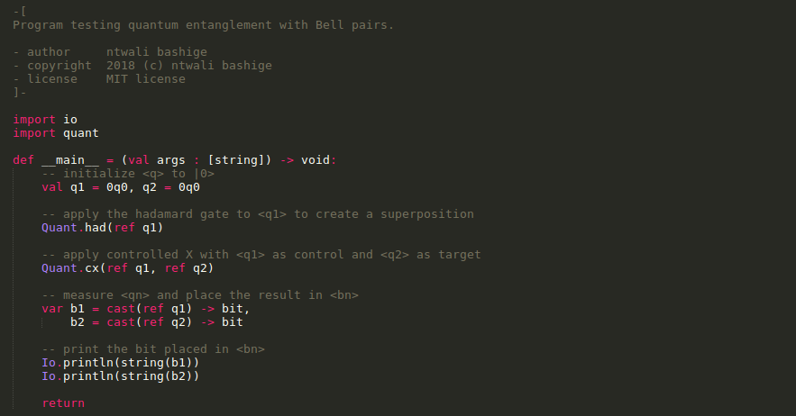

# Avalon - Classical/Quantum programming language

Quantum computing is progressing slowly but surely. And as it progresses, tools are going to be needed to program quantum computers.

Avalon is a programming language aimed at a specific class of quantum computers called classical-quantum hybrid quantum computers.
A hybrid classical-quantum computer has the property of having a classical computer driving (telling) the quantum computer what to do.
These computers are being built by IBM and Rigetti and Avalon seeks to target both, starting with Rigetti.

Currently, all you will get is an interpreter to start prototyping on your own system while I'm working on generating QUIL (Rigetti) code.
The documentation can be found at [Read The Docs](https://avalon-lang.readthedocs.io/en/latest) and please do look in the `examples` folder for sample code to run.

## What it looks like



## State of the project

Currently, the classical part is close to 90% finished (exclusing known bugs). The missing feature is pointer types.
Getters and setters are being reworked into a better form. Otherwise the rest works as intended.

The quantum part, 1-Qubit data types and gates that act on them are implemented and can be tested.
The 2-Qubits, 4-Qubits and 8-Qubits data types are implemented but gates that operate on them are still missing but upcoming.

## Show me the code

Please find below the teleportation code found in examples reproduced for your copy-paste-and-run pleasure.

```
import io
import quant

def __main__ = (val args : [string]) -> void:
    -- initialize quantum variables
    val source = 0q1,
        destination = 0q0,
        ancilla = 0q0

    -- create an entanglement between the destination and the ancilla
    Quant.had(ref destination)
    Quant.cx(ref destination, ref ancilla)

    -- perform the teleportation
    Quant.cx(ref source, ref ancilla)
    Quant.had(ref source)

    -- measure the source and the ancilla
    var source_bit = cast(ref source) -> bit,
        ancilla_bit = cast(ref ancilla) -> bit

    -- perform error correction on the destination
    if source_bit == 0b1:
        Quant.pz(ref destination)
    if ancilla_bit == 0b1:
        Quant.px(ref destination)

    -- measure and print the destination which should contain <0q1>
    var destination_bit = cast(ref destination) -> bit
    Io.println(string(destination_bit))

    return
```

## Installation

Currently, installation can only happen from source and the code has only been tested on a Linux system.  
Installation directions can be found at [installing Avalon](https://avalon-lang.readthedocs.io/en/latest/installation.html).

## Documentation

Documentation is currently being written as the language evolves.  
You can find the documentation at [Read The Docs](https://avalon-lang.readthedocs.io/en/latest).

## Contributing

Thank you for considering it.  
Send me a pull request in case you want to help.  
But do shoot me an email first so I get to know you.

## Contact

You can reach me at <a href="mailto:nbashige@gmail.com">nbashige@gmail.com</a>

## License

This code is licensed under the MIT license. Please see the LICENSE file for the terms.

## Copyrights

I, Ntwali Bashige Toussaint, retain all copyrights in and of the entirety of the work (source code and other files) in this repository whether explicitly mentionned or not in any of the files in this project.  
This excludes all the files in the `deps` directory.

In case you found code that is yours and I failed to give attribution or I am claiming copyright of the code, please do email me to resolve the issue.

